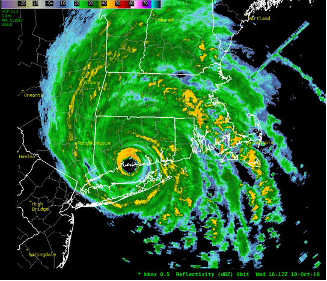
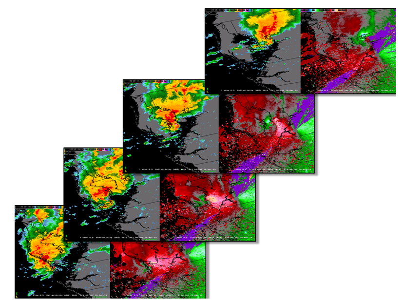
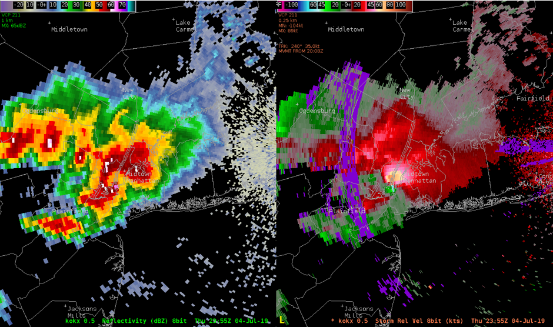
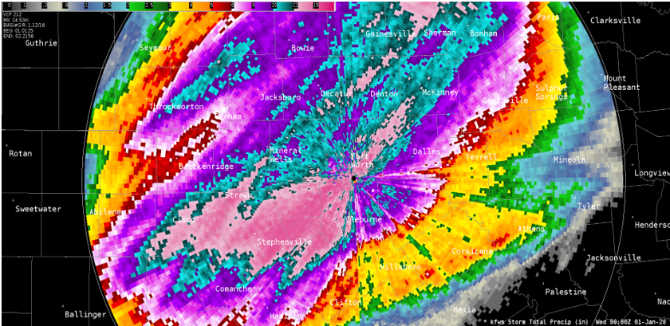
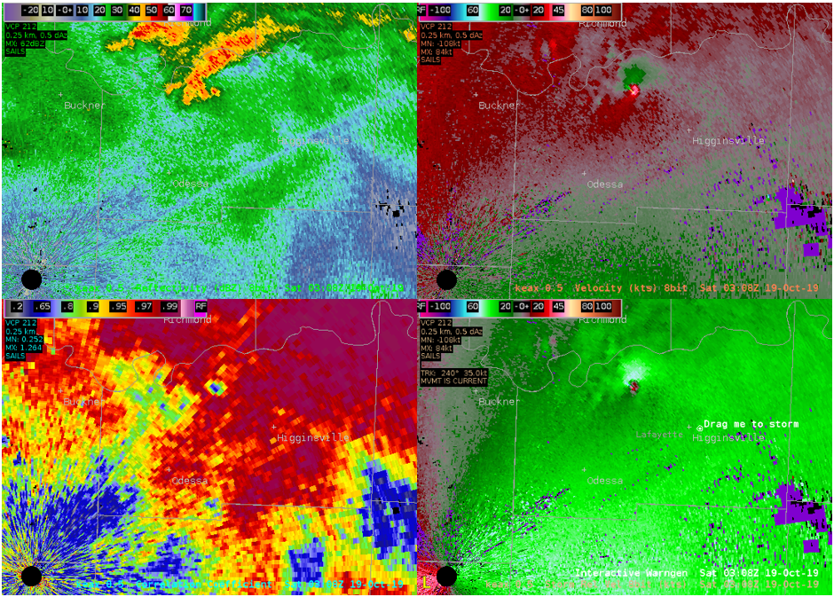

<header>
</header>

## Introducing Level3_Anywhere

The <b>level3</b>_anywhere software package provides a python-based application to convert level3 radar products from an original Radar Product Generator (RPG) radar site to any other valid RPG radar site. This application was designed to allow / supply a more robust case study archive for training of meteorologists within their respective region of responsibility utilizing software that decodes level3 radar data, such as the Advanced Weather Interactive Processing System (AWIPS), level 3 based Gibson Ridge Radar Software applications, the NOAA Weather and Climate Toolkit, and others.   

With level3_anywhere, past significant weather event from anywhere within the NEXRAD network can be remapped and displayed to the radar and corresponding geographic region of the user's choosing.  For training purposes, the date of the event may be changed in the level3 file as well in order to hide the identity of well-known events during training exercises.  

The software can handle automatic processing of everything from one single level 3 product file to hundreds or thousands of files that would constitute an entire weather event worth of level 3 files. All level 3 products and product identifiers are supported with the current software release. 

Below we see a screenshot of data from the KBMX radar (NWS Birmingham, AL) from April 11th, 2011 remapped to the KTBW radar (NWS Tampa Bay Area). In this instance, the Tuscaloosa EF-4 tornado event is now impacting the coastline of Pinelles County, Florida.  

<b>April 27th, 2011 Tuscaloosa to Birmingham Tornado - KBMX (Birmingham, AL) remapped to display at KTBW (Ruskin,FL)</b>

<!---->

## How to Use

These python scripts are designed to be run via the command line. 

1) Place the scripts in a master directory of your chooseing. For this example the master directory will be <b>/home/streamlineweather/Convert_Level3/</b> 
2) Place the original level 3 radar files in a directory called "data" within the master directory. For this example <b>/home/streamlineweather/Convert_Level3/data</b>. 
3) For the script <b> convert_level3.py </b> in which only the data RPG station is being changed and not the dates of the data, the command line structure is as follows: 

<b>python convert_level3.py "old_station_id" "new_station_id" "data_directory" "product_string" </b>   
"product string" can be any valid level3 product Identifier (for example N0Q).  
In this case, files in the /home/streamlineweather/Convert_Level3/data/ directory containing the selected product string will be converted from the <b>old station</b> id to the <b>new station id</b>. If the string "all" is used for the product string, all files / products within the /home/streamlineweather/Convert_Level3/data/ directory will be converted from the <b>old_station_id</b> to the <b>new_station_id</b>.  

Below you will find two examples for converting level 3 data from station to station without changing the date of the data.<b> 

<b>python convert_level3.py BMX TBW /home/streamlineweather/Convert_Level3/data/ all</b></b> 
- All files in the data directory from the BMX (Birmingham, AL) radar site will be converted to the TBW (Ruskin, FL) radar site.   

<b>python convert_level3.py BMX TBW /home/streamlineweather/Convert_Level3/data/ N0Q</b> 
- All files in the data directory from the BMX (Birmingham, AL) radar site with the string "N0Q" in the filename will be converted to the TBW (Ruskin, FL) radar site.   

Below you will find examples for converting level 3 data from station to station and changing the date of the data. 

<b>python convert_level3_dates.py "old_stid" "new_stid" "data_directory" "YYYY/MM/DD" "product_string"</b> 

In this case, files in the /home/streamlineweather/Convert_Level3/data/ directory containing the selected product string will be converted from the <b>old station</b> id to the <b>new station id</b>. The created files for the <b>"new station"</b> will have a new date_time stamp corresponding to the <b>YYYY/MM/DD</b> used in the command line. 

<b>python convert_level3_dates.py BMX TBW /home/streamlineweather/Convert_Level3/data/ 2020/03/12 all"</b> 
- All files in the data directory from the BMX (Birmingham, AL) radar site will be converted to the TBW (Ruskin, FL) radar site with a new date_time stamp of March 12, 2020.   

<b>python convert_level3_dates.py BMX TBW /home/streamlineweather/Convert_Level3/data/ 2022/05/25 NQ0"</b> 
- All files in the data directory from the BMX (Birmingham, AL) radar site with the string "N0Q" in the filename will be converted to the TBW (Ruskin, FL) radar site with a new date_time stamp of May 25th, 2022.   

## Contributions
Contributions to Level3_Anywhere project are welcome. If you find any issues or have suggestions for improvements, please feel free to submit a pull request or open an issue in the GitHub repository.

## License
Level3_Anywhere is created by Bryan Mroczka of Streamline Weather Consulting, LLC. Users are free to use, modify, and distribute the code in accordance with the terms of the license.

## Additional Remapping Examples - AWIPS2 Screenshots

<b>October 10th, 2018 Hurricane Micheal - KTLH (Tallahassee, FL) mapped to KBOX (Boston, MA)
</b> 

 

<b>April 27th, 2014 Mayflower Arkansas long track EF-4 Tornado - KLZK (Little Rock, AR) mapped to KTBW (Ruskin, FL) 

</b>

 

<b>KSGF (Springfield, MO) mapped to KOKX (Upton, NY)  at 7:55 PM EDT July 4th, 2019 
(Directly over Midtown Manhattan)
</b> 

 

<b>May 1 - 2, 2010 Nashville Flash Flooding Event - KOHX (Nashville, TN) mapped to KFWS (Fort Worth, TX) Date/Time Changed at 12:00AM New Years Eve 2020
</b> 

 

<b>October 18th, 2019 Polk County, Florida EF-2 long track tornado - KTBW (Ruskin, FL) remapped to KEAX (Kansas City, MO) radar

</b> 

<footer>

<!--
  <<< Author notes: Footer >>>
  Add a link to get support, GitHub status page, code of conduct, license link.
-->

</footer>
