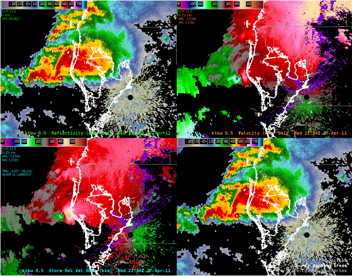

<header>
## Introducing Level 3 Anywhere
</header>

## Introducing Level3_Anywhere

The level3_anywhere software package provides a python-based application to convert level3 radar products from an original Radar Product Generator (RPG) radar site to any other valid RPG radar site. This application is designed to allow for a more robust case study archive for training of meteorologists within software that decodes level3 radar data, such as the Advanced Weather Interactive Processing System (AWIPS). With level3_anywhere, any past significant weather event from anywhere within the NEXRAD network can be remapped and displayed to the radar and corresponding geographic region of the user's choosing. 

The software can handle automatic processing of everything from one single level 3 product file to hundreds or thousands of files that would constitute an entire weather event worth of level 3 files. All level 3 products and product identifiers are supported with the current software release. 

Below we see a screenshot of data from the KBMX radar (NWS Birmingham, AL) from April 11th, 2011 remapped to the KTBW radar (NWS Tampa Bay Area). In this instance, the Tuscaloosa EF-4 tornado event is now impacting the coastline of Pinelles County, Florida.  

 
<b>April 27th, 2011 Tuscaloosa to Birmingham Tornado -  
KBMX (Birmingham, AL) mapped to KTBW (Ruskin,FL)</b>

<!---->

## How to Use

print("<old_stid> <new_stid> <path> <product string>")
print("BMX TBW /home/bryan/Convert_Level3/data/ all")
print("or...")
print("BMX TBW /home/bryan/Convert_Level3/data/ NQ0")

## Installation
No installation is required for this web application. Simply access the WeatherSense through your web browser from the link --link--

## Contributions
Contributions to Level2_Anywhere project are welcome. If you find any issues or have suggestions for improvements, please feel free to submit a pull request or open an issue in the GitHub repository.

## License
Level3_Anywhere is created by Bryan Mroczka of Streamline Weather Consulting, LLC. Users are free to use, modify, and distribute the code in accordance with the terms of the license.

## Acknowledgements

## Additional Remapping Examples

## Final Thoughts

<footer>

<!--
  <<< Author notes: Footer >>>
  Add a link to get support, GitHub status page, code of conduct, license link.
-->

</footer>
